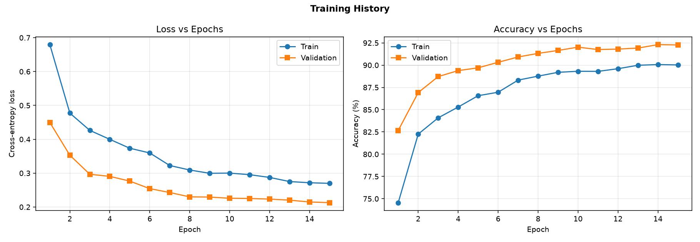
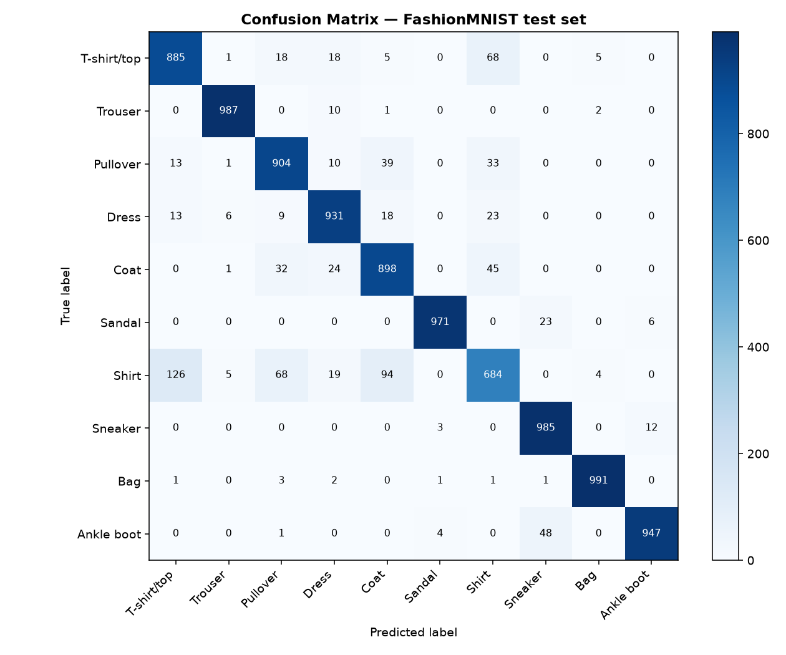
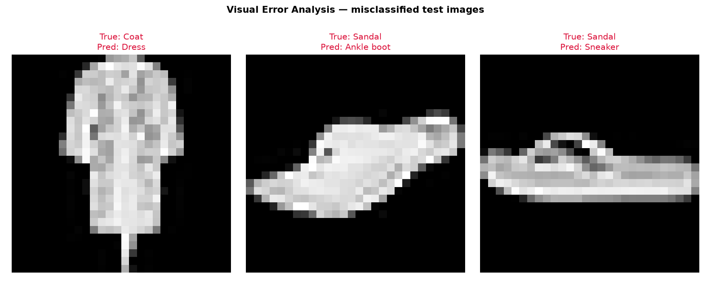
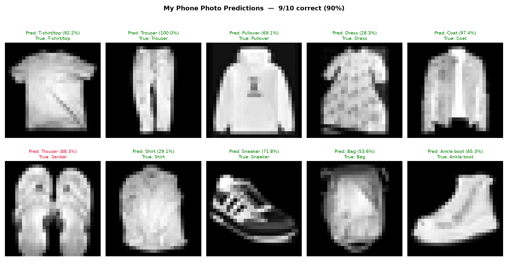

# CNN Image Classification with PyTorch

**FashionMNIST → my own smartphone photos**

I train a convolutional neural network on the standard FashionMNIST dataset and then
use it to classify ten photographs of my own clothes and shoes, taken with my phone.

[](https://colab.research.google.com/github/sahedulislamrony/CNN_Image_Classification/blob/main/220123.ipynb)

| | |
|---|---|
| **Student ID** | 220123 |
| **Dataset** | FashionMNIST — 60,000 train / 10,000 test, 28×28 grayscale, 10 classes |
| **Architecture** | 3 convolutional blocks (32→64→128) + 2 fully-connected layers |
| **Parameters** | 437,226 trainable |
| **Loss / Optimizer** | `nn.CrossEntropyLoss` / `torch.optim.Adam` (lr 1e-3, StepLR γ=0.3 every 6 epochs) |
| **Epochs** | 15, batch size 64 |
| **Best validation accuracy** | **92.30 %** |
| **Standard test-set accuracy** | **91.83 %** (9,183 / 10,000) |
| **My phone-photo accuracy** | **9 / 10** |

---

## Repository layout

```
.
├── 220123.ipynb          the notebook — the single source of truth
├── dataset/              my 10 smartphone photos
├── model/
│   └── 220123.pth        trained state dict (torch.save(model.state_dict(), …))
├── assets/               the plots embedded in this README, plus metrics.json
├── README.md
└── .gitignore
```

`220123.ipynb` is self-contained: it defines the transforms, the `CNN` class, the
training loop and the photo preprocessing inline, and imports nothing beyond what
Google Colab already provides (`torch`, `torchvision`, `numpy`, `matplotlib`, `PIL`,
`scikit-learn`). There is no helper module to install or copy.

## Running it

Opening the Colab badge and choosing **Runtime → Run all** reproduces everything below.
The notebook

1. `!git clone`s this repository (my photos + the saved weights),
2. downloads FashionMNIST through `torchvision.datasets`,
3. builds the CNN and loads `model/220123.pth` — setting `FORCE_RETRAIN = True` in the
   config cell trains the 15 epochs from scratch instead,
4. plots the training curves, confusion matrix and error analysis,
5. classifies all 10 of my photos and prints each prediction with its confidence.

Nothing has to be uploaded by hand and no paths need editing.

---

## 1. Model architecture

```
Input 1 × 28 × 28
│
├─ Block 1   Conv(3×3, 32) → BN → ReLU
│            Conv(3×3, 32) → BN → ReLU
│            MaxPool(2×2) → Dropout(0.25)          →  32 × 14 × 14
│
├─ Block 2   Conv(3×3, 64) → BN → ReLU
│            Conv(3×3, 64) → BN → ReLU
│            MaxPool(2×2) → Dropout(0.25)          →  64 × 7 × 7
│
├─ Block 3   Conv(3×3, 128) → BN → ReLU
│            MaxPool(2×2) → Dropout(0.25)          → 128 × 3 × 3
│
└─ Head      Flatten(1152) → Linear(256) → ReLU
             Dropout(0.5) → Linear(10)             →  10 logits
```

Padding of 1 on every 3×3 convolution keeps the spatial size intact, so each
`MaxPool2d(2)` is what halves it: 28 → 14 → 7 → 3. Channels double as the resolution
shrinks, trading spatial detail for feature depth.

The network outputs **raw logits**. `nn.CrossEntropyLoss` applies log-softmax
internally during training, and I apply `torch.softmax` explicitly at prediction time
to read off the confidence percentages.

Batch normalisation after each convolution and dropout after each block are what keep
a 437k-parameter network from memorising 54k images. Final training accuracy (90.0 %)
sits *below* validation accuracy (92.3 %) — the signature of a model that is still
regularised rather than overfitting, since dropout and augmentation are active during
the training pass but not the validation pass.

## 2. Data preprocessing

I use two transform pipelines:

```python
EVAL_TRANSFORM = transforms.Compose([
    transforms.Grayscale(num_output_channels=1),
    transforms.Resize((28, 28)),
    transforms.ToTensor(),
    transforms.Normalize((0.2860,), (0.3530,)),   # FashionMNIST channel statistics
])

TRAIN_TRANSFORM = ... same, plus RandomHorizontalFlip
                       and RandomAffine(degrees=8, translate=0.08, scale=0.92–1.08)
```

`EVAL_TRANSFORM` is my single source of truth for inference — the identical object is
applied to the standard test set and to my phone photos, so the `Normalize` constants
can never diverge between the two. `Grayscale(1)` is a no-op on FashionMNIST but
converts an RGB phone photo to the single channel the network expects.

I split the 60,000 training images 54,000 / 6,000 for train / validation. The
validation split is read through `EVAL_TRANSFORM`, so validation accuracy is measured
without random augmentation.

## 3. Training history



Loss falls smoothly on both curves with no divergence, and the StepLR drop at epoch 6
shows up as the point where the curves flatten into their final approach.

## 4. Confusion matrix



| True class | Precision | Recall | F1 |
|---|---|---|---|
| T-shirt/top | 0.8526 | 0.8850 | 0.8685 |
| Trouser | 0.9860 | 0.9870 | 0.9865 |
| Pullover | 0.8734 | 0.9040 | 0.8885 |
| Dress | 0.9181 | 0.9310 | 0.9245 |
| Coat | 0.8512 | 0.8980 | 0.8740 |
| Sandal | 0.9918 | 0.9710 | 0.9813 |
| **Shirt** | **0.8009** | **0.6840** | **0.7379** |
| Sneaker | 0.9319 | 0.9850 | 0.9577 |
| Bag | 0.9890 | 0.9910 | 0.9900 |
| Ankle boot | 0.9813 | 0.9470 | 0.9639 |

The five most frequent confusions:

```
126  Shirt        misread as T-shirt/top
 94  Shirt        misread as Coat
 68  T-shirt/top  misread as Shirt
 68  Shirt        misread as Pullover
 48  Ankle boot   misread as Sneaker
```

Every top confusion involves **Shirt**, the only class below 0.75 F1. This is a
property of the dataset rather than a bug: at 28×28 a shirt, a t-shirt, a pullover and
a coat are four upper-body garments that differ mainly in sleeve length and whether a
button placket is visible, and that detail largely disappears at this resolution. The
footwear and Bag classes, which have distinctive silhouettes, all clear 0.95 F1.

## 5. Visual error analysis



817 of the 10,000 test images were misclassified.

## 6. Real-world testing on my phone photos



### My photos

I photographed one item per FashionMNIST class and named each file
`<index>_<class-slug>.jpg`, so the notebook recovers the ground-truth label straight
from the filename and can print **True:** beside **Pred:**.

| File | Class | Predicted | Confidence |
|---|---|---|---|
| `01_tshirt.jpg` | T-shirt/top | T-shirt/top | 92.2 % |
| `02_trouser.jpg` | Trouser | Trouser | 100.0 % |
| `03_pullover.jpg` | Pullover | Pullover | 69.1 % |
| `04_dress.jpg` | Dress | Dress | 28.3 % |
| `05_coat.jpg` | Coat | Coat | 97.4 % |
| `06_sandal.jpg` | Sandal | ❌ Trouser | 88.3 % |
| `07_shirt.jpg` | Shirt | Shirt | 29.1 % |
| `08_sneaker.jpg` | Sneaker | Sneaker | 71.8 % |
| `09_bag.jpg` | Bag | Bag | 53.6 % |
| `10_ankleboot.jpg` | Ankle boot | Ankle boot | 65.3 % |

### The domain gap

A photo I take is not a FashionMNIST image, and feeding one straight into
`Resize → ToTensor → Normalize` produces nonsense:

| | FashionMNIST | My phone photo |
|---|---|---|
| channels | 1 (grayscale) | 3 (RGB) |
| resolution | 28 × 28 | 456×586 up to 3000×4000 |
| polarity | **bright** object on a **black** background | often a **dark** object on a **light** background |
| framing | object fills the frame | object floats in a wide frame |

`prepare_photo()` closes that gap before the shared transform runs:

1. **EXIF-transpose** — honour the phone's rotation metadata.
2. **Grayscale.**
3. **Auto-invert** when the background is the lighter region, so the garment ends up
   bright on black like the dataset.
4. **Crop to the object's bounding box** via a brightness threshold, padded back out
   to a square so the aspect ratio survives the resize.
5. **Contrast stretch.**

Only then does the unmodified `EVAL_TRANSFORM` run. Section 6.1 of the notebook shows
all four stages side by side for one photo.

### Choosing the inversion rule

The auto-invert step decides the polarity of every photo, so getting it wrong costs a
whole prediction. My first version compared the median brightness of a border frame
against a fixed mid-grey of 127. That works only while the garment stays inside the
frame. My dress photo breaks it: the dress runs off the edges of the shot, dragging
the border median down to **126** — one grey level under the threshold — so the photo
was left un-inverted, the model saw a dark garment on a light field, and it answered
Shirt.

Comparing the two regions against each other instead of testing one against a constant
removes the arbitrary number entirely:

```python
return float(np.median(border)) > float(np.median(centre))
```

| Photo | border | centre | invert? |
|---|---|---|---|
| `01_tshirt.jpg` | 0 | 118 | no |
| `02_trouser.jpg` | 127 | 162 | no |
| `03_pullover.jpg` | 239 | 59 | **yes** |
| `04_dress.jpg` | 126 | 57 | **yes** |
| `05_coat.jpg` | 252 | 44 | **yes** |
| `06_sandal.jpg` | 68 | 128 | no |
| `07_shirt.jpg` | 0 | 133 | no |
| `08_sneaker.jpg` | 255 | 116 | **yes** |
| `09_bag.jpg` | 0 | 139 | no |
| `10_ankleboot.jpg` | 255 | 56 | **yes** |

The relative rule is correct on all ten photos, including the five I shot against a
dark background where it correctly leaves them alone. Fixing it turned the dress from
Shirt into Dress and took the set from 8/10 to 9/10.

I also tested two more elaborate crops to try to rescue the last failure: Otsu
thresholding also scored 9/10, and Otsu plus largest-connected-component isolation
scored 8/10 — it fragments the densely patterned dress and loses it. The simple
bounding-box crop is both the simplest and the joint-best, so that is what I kept.

### The remaining failure

**`06_sandal.jpg`** is a *pair* of flip-flops photographed from above, while every
FashionMNIST sandal is a single shoe in side profile. Two parallel bright shapes look
far more like Trouser than like footwear, and the model says so at 88.3 % — its most
confident mistake anywhere in the set. This is the framing of the photo rather than a
preprocessing failure; the sandals are cleanly segmented and correctly not inverted.

The confidences elsewhere track the per-class F1 scores closely. Classes with
distinctive silhouettes — Trouser, Coat, T-shirt/top — are called at 92–100 %, while
Dress and Shirt scrape in at 28–29 % even though both are correct, which is exactly
what a 0.7379 F1 on Shirt and a densely patterned dress should produce. The model is
not uniformly confident; it is *uncertain* across precisely the garment group it could
never separate during training.
